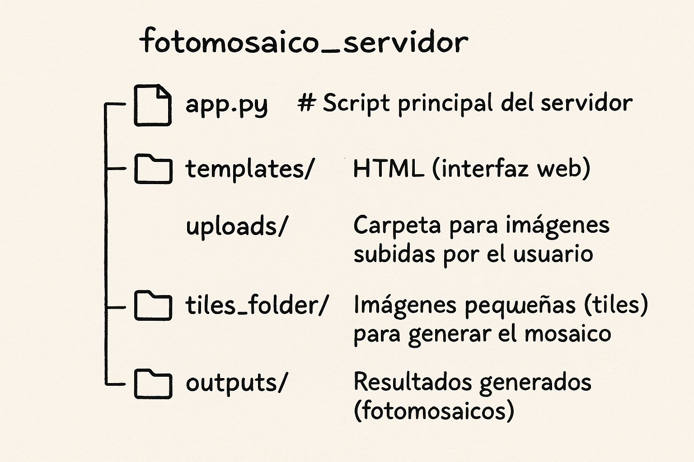

# Servidor de Fotomosaicos

Este proyecto implementa un servidor web que permite generar **fotomosaicos** a partir de una imagen subida por el usuario. Utiliza una carpeta de imágenes pequeñas (tiles) para reconstruir visualmente la imagen original mediante composición de mosaicos.

## ⚙️ ¿Cómo funciona?

1. El usuario accede a una interfaz web simple.
2. Sube una imagen.
3. El servidor toma esa imagen y la reconstruye usando las imágenes de la carpeta `tiles_folder/`.
4. El resultado se guarda en la carpeta `outputs/`.

## 📁 Estructura del proyecto

```
fotomosaico_servidor/
├── app.py             # Script principal del servidor
├── templates/         # HTML (interfaz web)
├── uploads/           # Imágenes subidas por el usuario
├── tiles_folder/      # Imágenes pequeñas (tiles)
└── outputs/           # Resultados generados (fotomosaicos)
```

Visualmente:



## 🚀 Cómo usar

1. Coloca las imágenes tiles en la carpeta `tiles_folder/`.
2. Ejecuta el servidor:
   ```bash
   python app.py
   ```
3. Abre tu navegador y entra a `http://localhost:5000`.
4. Sube una imagen y espera el resultado en la carpeta `outputs/`.

## 🧰 Tecnologías usadas

- Python
- Flask
- PIL / OpenCV
- HTML + Jinja2
